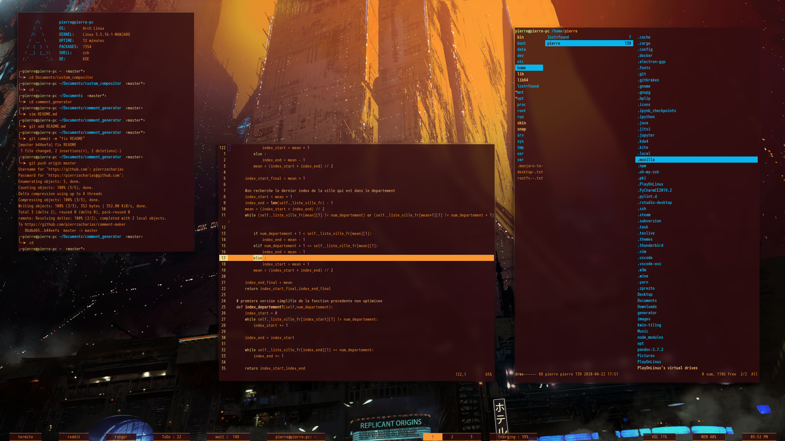

# Saving my dotfiles

* KERNEL : KDE plasma
* SHELL : zsh
* THEME : KDE-gaps-glow
* TERMINAL : Termite
* FONT : mplus Nerd
* COMPOSITOR : picom
* BAR : polybar

To compile vim in python mode:
```
git clone https://github.com/vim/vim & cd vim/
./configure --prefix=/usr/local \
            --enable-python3interp \
            --with-python3-config-dir=/usr/lib/python3.8/config-3.8-x86_64
sudo make
sudo make install
```


