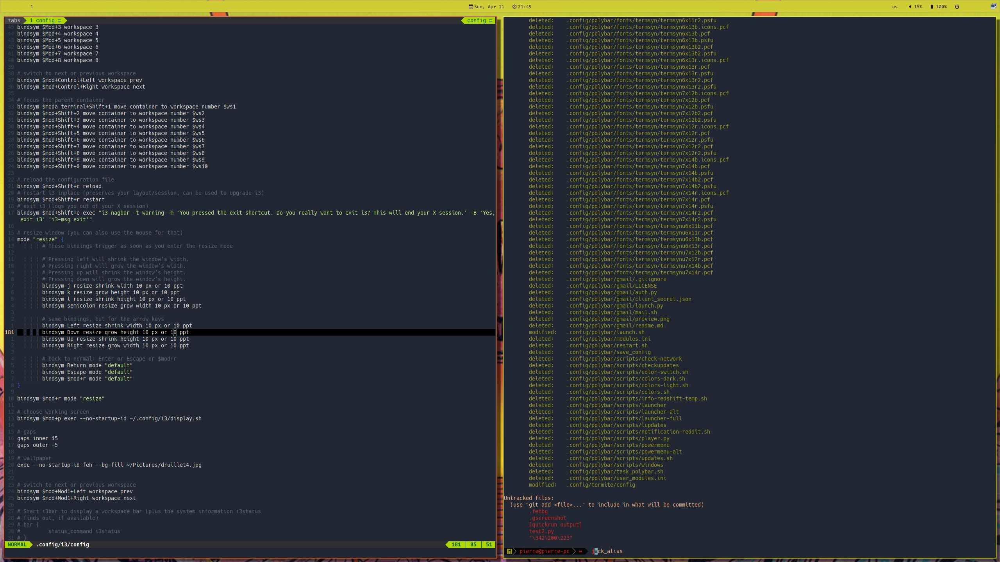

# Saving my dotfiles

* KERNEL : KDE plasma
* SHELL : zsh
* TERMINAL : Termite
* FONT : M+ 1mn
* COMPOSITOR : picom
* BAR : polybar



To compile vim in python mode:
```
git clone https://github.com/vim/vim & cd vim/
./configure --prefix=/usr/local \
            --enable-python3interp \
            --with-python3-config-dir=/usr/lib/python3.8/config-3.8-x86_64
sudo make
sudo make install
```


This config uses several workflows to execute and debug python files:
* [vim-quickrun](https://github.com/thinca/vim-quickrun): run with <Alt-i>, the runner is 'system' by default, it allows this behaviour:
    - if the execution sucess, the output is written in a new buffer. (1th screenshot)
    - if the execution failed, the error are parsed in the vim-builtin location list. (2th screenshot)
    - this runnner don't allow to use the debugging tool pdb
If you want to use pdb with vim-quickrun, set "runner" to "terminal", no error parsing in quickfix list though.
* We can also use the vim-builtin compiler :make configured in .vim/compiler/python.vim to parce the errors in the vim-builtin quickfix list.
* Other way: simply open a new terminal and run the python script (working directory must be correctly set). This allows using the pdb debugging tool. (3th screenshot)
- With [vimspector](https://github.com/puremourning/vimspector/), we can use a complete debugger tool (Need vim compiled with +python). (4th screenshot)


