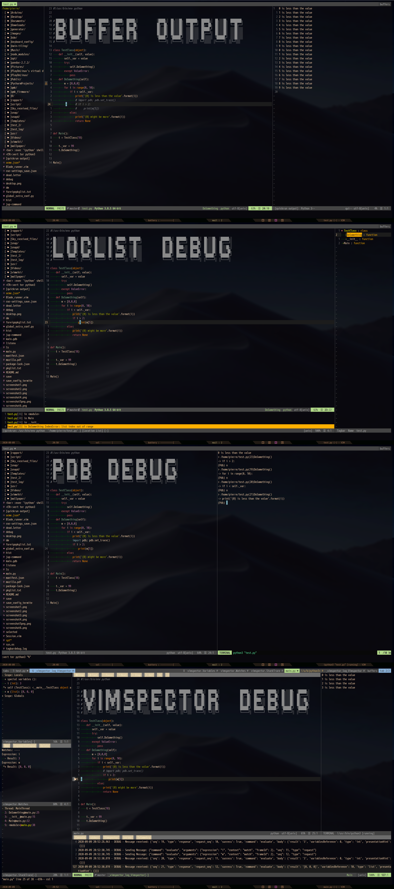

# Saving my dotfiles

* KERNEL : KDE plasma
* SHELL : zsh
* THEME : KDE-gaps-glow
* TERMINAL : Termite
* FONT : mplus Nerd
* COMPOSITOR : picom
* BAR : polybar

To compile vim in python mode:
```
git clone https://github.com/vim/vim & cd vim/
./configure --prefix=/usr/local \
            --enable-python3interp \
            --with-python3-config-dir=/usr/lib/python3.8/config-3.8-x86_64
sudo make
sudo make install
```


This config uses several workflows to execute and debug python files:
* With [vim-quickrun](https://github.com/thinca/vim-quickrun):
- if the execution sucess, the output is written in a new buffer. (3th screenshot)
* if the execution failed, the error are parsed in the vim-built in location -ist. (4th screenshot)
* With the vim-builtin compiler (:make), we can use the usefull pdb library in a new terminal to debug the file. (5th screenshot)
- With [vimspector](https://github.com/puremourning/vimspector/), we can use a complete debugger tool. (6th screenshot)



